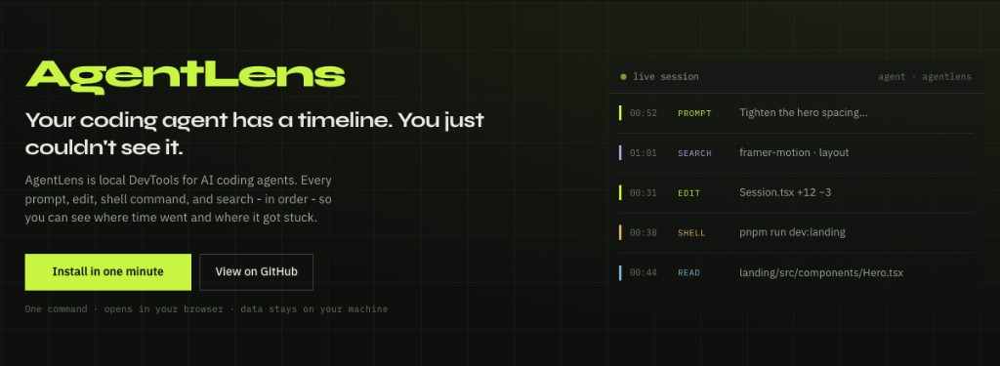

# AgentLens

**DevTools for AI coding agents.**

Local timeline for what your coding agent actually did - prompts, file reads, edits, shell commands, and searches - so you can see where time went and where it got stuck.

Supports **Claude Code** (live capture) and **Cursor** (import). More agents coming.



Docker image: [ratheshprabakar/agentlens](https://hub.docker.com/r/ratheshprabakar/agentlens)

---

## Install

**Requirements:** [Docker Desktop](https://www.docker.com/get-started/) and `curl`.

```bash
curl -sSL https://raw.githubusercontent.com/Ratheshprabakar/AgentLens/master/scripts/install.sh | bash
```

That one command:

1. Pulls the AgentLens image from Docker Hub
2. Starts a single container (app + embedded Postgres)
3. Installs Claude Code hooks on your machine
4. Opens the dashboard (default **http://localhost:4040**)

You do not type volume mounts.

**If port 4040 is already in use:**

```bash
PORT=4050 curl -sSL https://raw.githubusercontent.com/Ratheshprabakar/AgentLens/master/scripts/install.sh | bash
```

Then open **http://localhost:4050**.

### After the first install

- Start/stop the **agentlens** container in Docker Desktop (or leave it running).
- Open the dashboard URL in your browser.
- Run your agent as usual - live sessions show up on the timeline.
- You do **not** need to re-run the curl install unless you are updating or recreated the container.

---

## Stop / uninstall

```bash
# Stop the app (keeps saved sessions in the Docker volume)
docker stop agentlens

# Remove the container (data volume kept)
docker rm agentlens

# Delete stored sessions too
docker volume rm agentlens-data

# Remove Claude Code hooks only
curl -sSL https://raw.githubusercontent.com/Ratheshprabakar/AgentLens/master/scripts/install.sh | bash -s -- --uninstall-hooks
```

---

## How it works

```
Your coding agent (e.g. Claude Code)
        │
        ▼  hooks POST each event
   http://localhost:4040/api/events
        │
        ▼
┌─────────────────────────────────────┐
│  Docker - ratheshprabakar/agentlens │
│                                     │
│  App  →  ingest / import / UI       │
│   │                                 │
│   └─→  Embedded PostgreSQL          │
│        (volume: agentlens-data)     │
└─────────────────────────────────────┘
```

| Capture path           | When                                | Needs AgentLens running? |
| ---------------------- | ----------------------------------- | ------------------------ |
| **Live hooks**         | Each tool call while the agent runs | Yes                      |
| **Startup import**     | When the container starts           | Backfills history        |
| **Transcript watcher** | Every few seconds while running     | Picks up growing files   |
